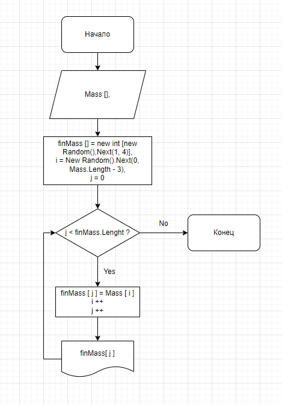

# Блок Схема 

# Что происходит?

## Программа работает так : ##

- Первым делом создаётся массив, из которого мы и будем брать нужные нам элементы. (в данном случае (a, b, c, d, e, f))
- После создаётся массив с размером от 0 до 3 элементов.
- Создаются указатели на элементы. Почему же в i есть строчка (Mass.Lenght - 3)? Дело в том, что по умолчанию нам нужно поставить отнять единицу из максималного значения, но у меня программа работает так, что она будет брать только 3 числа, которые будут идти друг за другом. Таким образом, чтобы не выйти из массива, мне нужно отнять ещё два числа. Таким образом и получается -3. 
- Дальше создаётся цикл, в котором значения из начального массива записываются в конечный и выводятся в консоль, чтобы мы убедились, что всё работает хорошо.
- Цикл завершается, и мы получаем нужный массив.